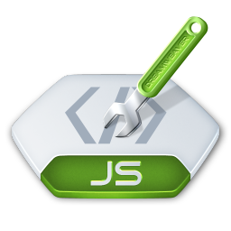

# JS Старт. Практические работы на курсе *SkillFactory* **'Профессия Веб-разработчик'**

Проект состоит из нескольких страниц.

Для каждой работы создана своя отдельная страница.

### На сайте используются собственные разработанные стили, а именно:

* Используются **шрифты Google-fonts**: (*'Montserrat', 'Roboto-Mono'; 'Roboto-Slab'; 'Reggae One', cursive;*).

* **Цвет фона и шрифта контрастны** (темный фон, светлый текст).

* На сайте **плавная анимация** при наведении на определенные элементы страницы (ссылки, кнопки и т.д.).

* В этом проекте использовал **псевдоэлементы** и **псевдоклассы** для улучшения внешнего вида сайта.

* Добавлены **иконки** во вкладку браузера (favicon).

* Сайт хорошо смотрится на мобильных устройствах с шириной экрана до *360px* (добавлен **адаптив**, убрал лишние элементы, уменьшил отступы).

* **Сайт проверен** в валидаторе W3C и прошел тест Google Lighthouse

# Проект: "Онлайн калькулятор"

Разработан в качестве практического задания на курсе *SkillFactory* **'Профессия Веб-разработчик'**.

## Используемые технологии

* **HTML**

* **CSS**

* **JavaScript**

## Как открыть/запустить

Зайти в папку сайта в файловом менеджере, кликнуть 2 раза по файлу ***index.html***.

* Калькулятор умеет работать с дробными числами и выполняет все представленные функции.

* С небольшим руководством по использованию можете ознакомиться на странице с этой работой.

* Не забудьте включить калькулятор, нажав на кнопку на панели управления! :)

* Для запуска функций добавил **анимированные кнопки** для улучшения внешнего вида.

* У пользователя есть возможность выбрать тему (внешний вид) калькулятора по клике на кнопку.

## Заключение

### Что удалось?

* **Создал** простой калькулятор, используя JavaScript; 

* **Применил собственные стили** к этой странице;

* **Закрепил знания** по HTML и CSS; 

* **Ознакомился** с базовыми возможностями **JavaScript**;

### Дальнейшие планы (что можно улучшить)

* Убрать дублирование кода JS. Упростить код. Попробовать решить задачу другим способом;

* Добавить еще несколько операций в калькулятор;

* Добавить  еще несколько тем для калькулятора;

* Устранить возможные баги и обработать ошибки, если обнаружатся при работе калькулятора

# Проект: "Игра 'Угадайка!'"

Разработан в качестве практического задания на курсе *SkillFactory* **'Профессия Веб-разработчик'**.

## Используемые технологии

* **HTML**

* **CSS**

* **JavaScript**

### На странице используются собственные разработанные стили, а именно:

* Используются **шрифты Google-fonts**: (*'Montserrat', 'Roboto-Mono'; 'Roboto-Slab'; 'Reggae One', cursive;*).

* **Цвет фона и шрифта контрастны** (темный фон, светлый текст).

* На странице реализована **плавная анимация** при наведении на определенные элементы страницы (ссылки, кнопки и т.д.).

* При открытии страницы всплывает **модальное окно** для получения информации от пользователя.

* В этом проекте использовал **псевдоэлементы** и **псевдоклассы** для улучшения внешнего вида.

* Добавлены **иконки** во вкладку браузера (favicon).

* Заполнены мета данные страницы

* Страница хорошо смотрится на **мобильных устройствах** с шириной экрана до *360px* (добавлен **адаптив**).

* **Страница проверена** в валидаторе W3C и Google Lighthouse

## Как открыть/запустить

* Зайти в папку сайта в файловом менеджере, кликнуть 2 раза по файлу ***index.html***.

* Ввести минимальное (до -999) и максимальное (до 999) значение.

* Загадать любое целое число.

* Нажать кнопку "Начать игру!".

* Нажимать кнопки 'Больше' или 'Меньше', пока не увидите загаданное вами число.

* Нажмите кнопку 'Заново', чтобы начать игру сначала.

## Заключение

### Что удалось?

* **Создал** простую игру, используя JavaScript; 

* **Применил собственные стили** к этой странице;

* **Закрепил знания** по HTML и CSS; 

* **Ознакомился** с базовыми возможностями **JavaScript**;

### Дальнейшие планы (что можно улучшить)

* Упростить код. Попробовать решить задачу другим способом;

* Устранить возможные баги, если обнаружатся при работе игры;

* Применить другие css стили;

